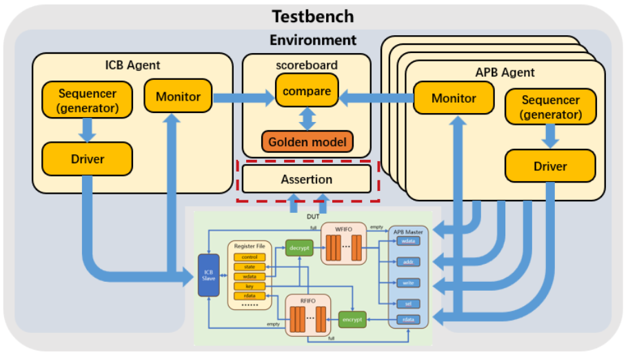
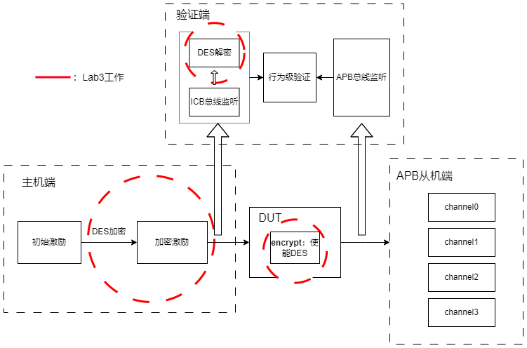

## 重要文件说明
design_files : DUT 可综合硬件实现

SVA : bindfile 连接验证平台进行 assertion

testbench : 单模块验证

testbench_platform : 完整验证平台

define.sv : 启用 DES / 启用 SVA 

doc_helps / guide / report : 设计指导与报告

## 验证框架

## 基于DES的验证框架
