# <center>System Verilog 实验报告</center>

## 1. 实验内容
&ensp;&ensp;&ensp;&ensp; **总线桥（bus bridge）** 是计算机系统中用于连接两种不同总线的硬件组件。总线桥的主要作用是实现不同总线之间的数据传输和协议转换，以确保多个设备之间的兼容性和通信。在SoC系统中，处理器常会与多个设备连接，因而总线桥常为一主多从或多主多从的实现形式。在某些涉及信息安全的场景下，主设备传输的数据可能是具有特定格式的加密数据，当从设备不具备解密功能时，则需额外的硬件电路实现加解密。本次实验需要实现一个 **具备加解密功能的一主四从总线桥** ，如下图所示：

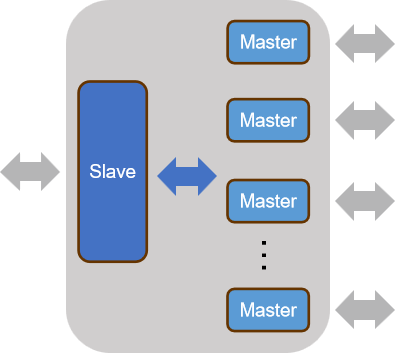

&ensp;&ensp;&ensp;&ensp; 系统整体架构设计如下图所示：

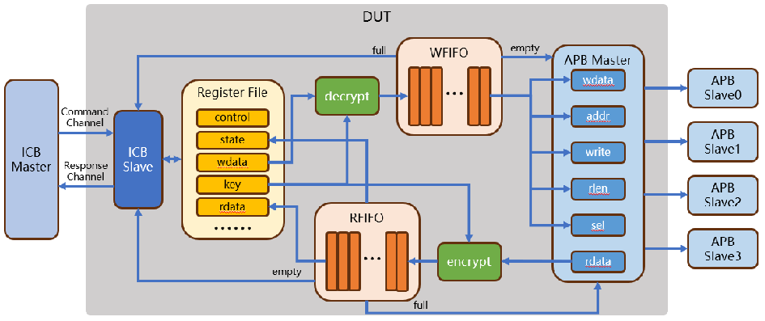


+  ICB从机模块：
    - 实现满足标准ICB时序的从机端口，数据位宽为64bit，地址位宽为32bit。
    - 维护特定的寄存器，包括CONTROL、STATE、WDATA、RDATA和KEY。
+  加密(encrypt)解密(decrypt)模块：
    - 使用配置的密钥，在数据写入FIFO前完成加密和解密。
    - 使用数据与密钥异或的方式进行加密、解密。
+  FIFO模块：
    - 设计FIFO的基本功能，控制数据的写入和读出。
    - 探索扩展FIFO的实现方式，如读写指针使用格雷码变换、读写时钟异步等。
+  APB主机模块：
    - 实现满足标准APB3时序的主机端口，数据位宽为32bit，地址位宽为32bit。
    - 对从WFIFO中获取的数据包进行解码，驱动APB Master执行相应操作。
    - APB从机返回的读数据，在[63:32]位补零后，送到加密模块加密，再送入RFIFO。
  

## 2. 模块设计
### 2.1 ICB从机模块 ( icb_slave )
&ensp;&ensp;&ensp;&ensp; ICB 总线主要包含 2 个通道：命令通道（cmd）与响应通道（rsp）
| 通道             | 方向   | 宽度 | 信号名        | 介绍                                                                                                                      |
| ---------------- | ------ | ---- | ------------- | ------------------------------------------------------------------------------------------------------------------------- |
| Command Channel  | Input  | 1    | icb_cmd_valid | 主设备向从设备发送读写请求信号                                                                                            |
| Command Channel  | Output | 1    | icb_cmd_ready | 从设备向主设备返回读写接受信号                                                                                            |
| Command Channel  | Input  | 32   | icb_cmd_addr  | 读写地址                                                                                                                  |
| Command Channel  | Input  | 1    | icb_cmd_read  | 读或是写操作的指示。读则以总线宽度（譬如32位）为单位读回一个数据。写则靠字节掩码(icb_cmd_wmask)控制写数据的大小（Size）。 |
| Command Channel  | Input  | 32   | icb_cmd_wdata | 写操作的数据，数据的摆放格式与AXI协议一致                                                                                 |
| Command Channel  | Input  | 4    | icb_cmd_wmask | 写操作的字节掩码，掩码的摆放格式与AXI协议一致                                                                             |
| Response Channel | Output | 1    | icb_rsp_valid | 从设备向主设备发送读写反馈请求信号                                                                                        |
| Response Channel | Input  | 1    | icb_rsp_ready | 主设备向从设备返回读写反馈接受信号                                                                                        |
| Response Channel | Output | 32   | icb_rsp_rdata | 读反馈的数据，数据的摆放格式与AXI协议一致                                                                                 |
| Response Channel | Output | 1    | icb_rsp_err   | 读或者写反馈的错误标志                                                                                                    |

&ensp;&ensp;&ensp;&ensp; 控制通道中，为了提高 icb 从机对主机的响应速度，一旦检测到主机发送的读写请求信号，立即对其做出响应，因此采用组合逻辑：
```systemverilog
always_comb begin : icb_cmd_ready
    if  ( icb_cmd_valid ) begin
        if ( !icb_cmd_read && icb_cmd_addr == ICB_SLAVE_WDATA && full ) begin
            icb_cmd_ready = 1'b0;
        end
        else begin
            icb_cmd_ready = 1'b1;
        end
    end
    else begin
        icb_cmd_ready = 1'b0;
    end
end
```
&ensp;&ensp;&ensp;&ensp; ***需要注意的是，如果 wfifo 满，且 icb 主机发送写请求，数据继续写入可能会导致 wfifo 内数据被覆写，因此在这种情况下，icb 从机 cmd_ready 信号拉低不对主机读请求响应***

&ensp;&ensp;&ensp;&ensp; 响应通道中，同样为了提高 icb 总线传输效率，在设计中，从机在检测到控制通道完成握手后下一周期，拉高读写反馈接受信号（rsp_valid），直到检测到主机读写反馈接受信号（rsp_valid）后拉低，表示完成一次读写过程。下面分别考虑读写两种情况：
+ 读：在拉高读写反馈接受信号（rsp_valid）同周期给出响应数据即可。但是，如果 icb 主机请求的数据为 RDATA 寄存器，由于 icb 主机请求数据需要从 rfifo 中读出，而从机发出 rsp_valid 信号同周期需要给出数据，因此 icb 从机需要在响应提前一个周期向 rfifo 发出读请求（rd_en）信号更新 RDATA ，即在控制通道握手周期判断是否读寄存器 RDATA ，如果是则向 rfifo 请求数据。
```systemverilog
assign rdata_en = icb_cmd_ready && icb_cmd_read && icb_cmd_addr == ICB_SLAVE_RDATA;
```
&ensp;&ensp;&ensp;&ensp; 同时，由于 rfifo 在接收到读数据使能信号，下一个周期才能返回 fifo 数据，而在前面我们提到，从机一旦检测到主机发送的读写请求信号，需要立即对其做出响应，下一周期即返回结果，因此这里我们必须采用组合逻辑对 icb_rsp_rdata 赋值，而不能是时序逻辑。同时需要增加 mux 选择数据来源是 icb 从机的 csr 寄存器还是 rfifo，选通逻辑为 rfifo 读数据有效信号。
```systemverilog
assign icb_bus.icb_rsp_rdata = fifo_data_vld ? rdata : icb_rsp_rdata_reg;
```
+ 写：写逻辑较为简单，控制通道握手时序逻辑在下一周期更新相应寄存器即可，这里不多做赘述，各寄存器读写逻辑仅在地址判断上存在区别。

&ensp;&ensp;&ensp;&ensp; ***需要注意的是，由于在控制通道已经对 wfifo 能否写入（full）进行判断，且在 fifo 的实现中，读写均采用时序逻辑，将 fifo 本身视为一个多 bit 移位寄存器，因此 RDATA 寄存器与 WDATA 寄存器的实现并不必要。在设计中，这里直接将这两个寄存器映射到 wfifo 的写接口与 rfifo 的读接口，wfifo 需要额外提供写使能逻辑***
```systemverilog
//  Wfifo
    always_ff @(posedge clk or negedge rst_n) begin : wdata_vld
        if ( !rst_n ) begin
            wdata_vld <= 1'b0;
        end
        else begin
            if( icb_cmd_ready && !icb_cmd_read && icb_cmd_addr == ICB_SLAVE_WDATA ) begin
                wdata_vld <= 1'b1;
            end else begin
                wdata_vld <= 1'b0;      // 1 cycle pulse
            end
        end
    end
```
### 2.2 加密模块 ( encrypt )
&ensp;&ensp;&ensp;&ensp;本次设计加解密算法采用异或加密，使用寄存器key配置的密钥，在数据写入FIFO前完成加密及解密。逻辑相对较为简单，为了提高系统性能，这里使用组合逻辑，为了后续实验拓展，即后续算法可能无法在一个周期内完成计算，因此接口中提供数据有效信号。
```systemverilog
assign result = data ^ key;
assign result_vld = data_vld;
```
### 2.3 解密模块 ( decrypt )
&ensp;&ensp;&ensp;&ensp;见2.2节。
### 2.4 fifo模块 ( fifo )
&ensp;&ensp;&ensp;&ensp;由于读写时钟域不同，对于 wfifo ，写端口在 icb 总线时钟域下，而读端口在 apb 时钟域下，因此设计中采用异步 fifo 的设计方法。具体到代码实现中，异步 fifo 的读写逻辑与同步 fifo 相似，唯一需要注意的是读写操作的时钟需要区分。与同步的 fifo 设计中不同的是，由于写指针 wptr 与读指针 rptr 也处于不同时钟域下，需要对时钟域进行同步进行空满判断。

&ensp;&ensp;&ensp;&ensp;当一个信号从一个时钟域传递到另一个不同时钟域时，由于时钟频率和相位的差异，信号可能会经历亚稳态。如果直接使用这个信号，可能会导致系统不稳定。因此这里使用打两拍（两个寄存器级）来同步指针。
```systemverilog
always_ff @(posedge rclk or negedge rst_n) begin
    if (!rst_n) begin
        wptr_gray_sync1 <= 0;
        wptr_gray_sync2 <= 0;
    end else begin
        wptr_gray_sync1 <= wptr_gray;
        wptr_gray_sync2 <= wptr_gray_sync1;
    end
end
```
&ensp;&ensp;&ensp;&ensp;这里两拍同步的并非原始的读写指针，而是对读写指针进行二进制到格雷码的转换后的指针。格雷码是一种二进制编码，其中连续的数值之间的编码只有一位发生变化。这意味着在格雷码中，指针值的变化（如从0110到0111）只涉及一位的跳变，而不是多位。这显著减少了由于时钟域不同步而可能发生的亚稳态情况。
```systemverilog
function logic [ADDR_WIDTH:0] bin2gray(input logic [ADDR_WIDTH:0] bin);
    return (bin >> 1) ^ bin;
endfunction

assign wptr_gray = bin2gray(wptr);
assign rptr_gray = bin2gray(rptr);
```
&ensp;&ensp;&ensp;&ensp;对同步后的指针进行空满逻辑判断，空判断逻辑与同步fifo一致，由于格雷码的特性，满的判断需要进行修改。
```systemverilog
assign empty = (rptr_gray == wptr_gray_sync2);
assign full  = (wptr_gray == {~rptr_gray_sync2[ADDR_WIDTH:ADDR_WIDTH-1], rptr_gray_sync2[ADDR_WIDTH-2:0]});     //格雷码判满：最高位和次高位都不等
```
### 2.5 APB主机模块 ( apb_master )
&ensp;&ensp;&ensp;&ensp;apb 协议的实现较为简单，**但是，在该设计中，由于 apb 主机需要的数据信息与控制信息均以数据包的格式从 wfifo 中获取，完成一次 apb 读需要从 wfifo 中读取两个数据包（一个包含地址的控制信息，一个包含需要发送的数据），完成一次 apb 写需要从 wfifo 中读取包含控制信息的数据包， 并对数据包解码获得控制信息（与数据信息）**，因此需要状态机来进行控制。数据包格式如下表所示：
| [31:8]                            | [7:2]                                               | [1]         | [0]         |
| --------------------------------- | --------------------------------------------------- | ----------- | ----------- |
| addr                              | select                                              | cmd         | flag        |
| 写到APB的地址，基地址为0x20000000 | 000001：APB0 000010：APB1 000100：APB2 001000：APB3 | 0：读 1：写 | 0：控制数据 |
| data[30:7]                        | data[6:1]                                           | data[0]     | 1：数据     |

&ensp;&ensp;&ensp;&ensp;这里将 apb 主机行为分为两个过程：数据准备与驱动 apb 数据传输。其中在数据准备中包括从 wfifo 中读取数据包与解码数据包两个过程，模块的状态机如下图所示：

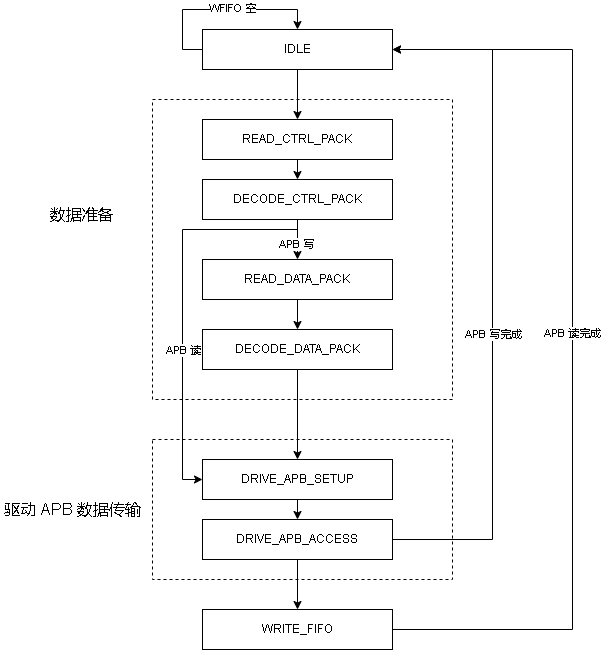

&ensp;&ensp;&ensp;&ensp;具体到代码实现如下：
```systemverilog
always_comb begin
    case ( state )
        IDLE: begin
            if ( !empty ) begin
                next_state = READ_CTRL_PACK;
            end else begin
                next_state = IDLE;
            end
        end
        READ_CTRL_PACK: begin
            next_state = DECODE_CTRL_PACK;
        end
        DECODE_CTRL_PACK: begin
            if ( pack_write ) begin               // apb_write
                if ( !empty ) begin
                    next_state = READ_DATA_PACK;      // wait for fifo not empty
                end else begin
                    next_state = DECODE_CTRL_PACK;      
                end
            end else begin                      // apb_read
                next_state = DRIVE_APB_SETUP;
            end
        end
        READ_DATA_PACK: begin
            next_state = DECODE_DATA_PACK;
        end
        DECODE_DATA_PACK: begin
            next_state = DRIVE_APB_SETUP;
        end
        DRIVE_APB_SETUP: begin
            next_state = DRIVE_APB_ACCESS;
        end
        DRIVE_APB_ACCESS: begin
            if (apb_pready) begin
                if ( pack_write_reg ) begin          // apb_write
                    next_state = IDLE;
                end else begin
                    next_state = WRITE_FIFO;   // apb_read
                end
            end else begin
                next_state = DRIVE_APB_ACCESS;
            end
        end
        WRITE_FIFO: begin
            if ( !full ) begin
                next_state = IDLE;
            end else begin
                next_state = WRITE_FIFO;
            end
        end
        default: begin
            next_state = IDLE;
        end
    endcase
end
```
&ensp;&ensp;&ensp;&ensp;下面对各个状态进行分析：
+ **IDLE** :

&ensp;&ensp;&ensp;&ensp;状态机初始状态或无 apb 读写任务的默认状态，一旦检测到 wfifo 非空，即存在数据包，则启动 apb 读写任务。

+ **READ_CTRL_PACK** :

&ensp;&ensp;&ensp;&ensp;这里依据数据包最后一位的不同，将其分为 CTRL_PACK 控制信息包与 DATA_PACK 数据包。这里要求 icb 主机完成一次 apb 从机写操作需要先发送一个控制信息包，再发送一个数据包，完成一次 apb 从机读操作则只需要发送一个控制信息包。因此由 IDLE 状态进入 apb 读写任务时，首先需要读 wfifo 获得控制信息包，wfifo 接收到读使能信号后下一周期发送数据。
```systemverilog
assign rdata_en = (state == READ_CTRL_PACK ) || (state == READ_DATA_PACK) ;
```
+ **DECODE_CTRL_PACK** :

&ensp;&ensp;&ensp;&ensp;对数据包进行解码，同时判断进行主机需要对 apb 从机读还是写：apb 读直接驱动 apb 总线，apb 写则需要继续读取 wfifo 内的数据包解码获得写数据。由于完成一次 apb 写操作需要读两次 wfifo ，且无法同时从 wfifo 中读取控制信息与数据信息，因此需要对控制信息进行寄存器寄存，以便等控制信息与数据信息对齐后再驱动 apb 总线写。

```systemverilog
always_ff @(posedge clk or negedge rst_n) begin
    if ( !rst_n ) begin
        pack_sel_reg <= 6'b0;
        pack_addr_reg <= 24'b0;
        pack_write_reg <= 1'b0;
    end
    else begin
        if ( pack_valid & ( pack_flag == 0 ) ) begin    // ctrl pack
            pack_sel_reg <= pack_sel;
            pack_addr_reg <= pack_addr;
            pack_write_reg <= pack_write;
        end
    end
end
```
+ READ_DATA_PACK : 
  
&ensp;&ensp;&ensp;&ensp;读 wfifo 数据包。
+ DECODE_DATA_PACK : 
  
&ensp;&ensp;&ensp;&ensp;解码数据包，寄存数据，下一周期驱动 apb setup。
+ DRIVE_APB_SETUP : 
  
&ensp;&ensp;&ensp;&ensp;从寄存控制信息与数据的寄存器中读出驱动 apb 总线需要的控制信息与数据信息，同时拉高总线 apb_setup 信号。
```systemverilog
always_comb begin
    if ( apb_setup && (pack_sel_reg == 6'b000001) ) begin
        apb_bus_0.pwrite = pack_write_reg;
        apb_bus_0.psel = 1'b1;
        apb_bus_0.paddr = pack_addr_reg;
        apb_bus_0.pwdata = pack_wdata_reg;
    end
    else begin
        apb_bus_0.pwrite = 1'b0;
        apb_bus_0.psel = 1'b0;
        apb_bus_0.paddr = 32'b0;
        apb_bus_0.pwdata = 32'b0;
    end
end

assign apb_setup = (state == DRIVE_APB_SETUP) || (state == DRIVE_APB_ACCESS); // apb setup and access 
```
+ DRIVE_APB_ACCESS : 
  
&ensp;&ensp;&ensp;&ensp;维持控制信息与数据信息， apb_setup 信号，拉高 apb_access信号。等待 apb 从机响应，一旦检测到从机的 pready 信号，完成本次 apb 读写操作。同时如果本次操作是 apb 读，则寄存读取到的数据，进入 WRITE_FIFO 状态，将数据准备写入 rfifo。
```systemverilog
assign apb_access = (state == DRIVE_APB_ACCESS);
```
+ WRITE_FIFO :

&ensp;&ensp;&ensp;&ensp;当 rfifo 不满时，将寄存的 apb 读数据写入 rfifo，下一周期回到 IDLE。
```systemverilog
assign wdata_vld = (state == WRITE_FIFO) && !full ;
```
## 3. 基本验证设计
### 3.1 APB主机模块验证
&ensp;&ensp;&ensp;&ensp;对 apb master 独立模块进行读写测试，由于不是对整个系统进行完整验证，我们用 testbench 输入向量激励模拟 fifo 与 apb 从机的行为。在 apb master 发送 rdata_en 的 wfifo 读使能信号后，下一周期 wfifo 发送相应测试向量 rdata。在 apb master 拉高 psel 选通与 penable 使能后，从机同周期立即响应，如果读，则同步发送数据。
#### 3.1.1 APB 读
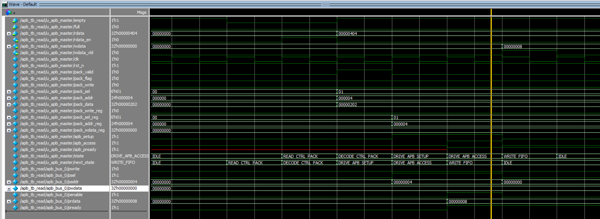

&ensp;&ensp;&ensp;&ensp;如上图所示，为 apb 读测试。这里我们从 wfifo 读出的测试向量为 {24'h000004, 8'b00000100}，即 bus0 读，地址为 24'h000004。从波形图中我们可以看到，当 wfifo 拉低 empty 信号，表示有数据包在 wfifo 中时，apb master 向其发送读使能信号，下一周期读出测试向量 {24'h000004, 8'b00000100}，在 DECODE_CTRL_PACK 周期完成对测试向量的译码，并将相关控制信息存储在寄存器 _reg 中。此时状态机解析得知这次完成的 apb 操作为读（第 2 位为 0），因此下一周期直接进入 DRIVE_APB_SETUP 状态驱动 apb。apb 总线信号维持一周期后，拉高 penable，apb 从机响应并发送数据 0x00000008，判断 rfifo 不满后下一周期完成 rfifo 写（wdata_vld拉高一周期）。这里我们还对从机的响应延迟进行了调整，如果 apb 从机无法立即响应读，下一周期返回数据时，apb master 仍然完全正确实现功能。
#### 3.1.2 APB 写
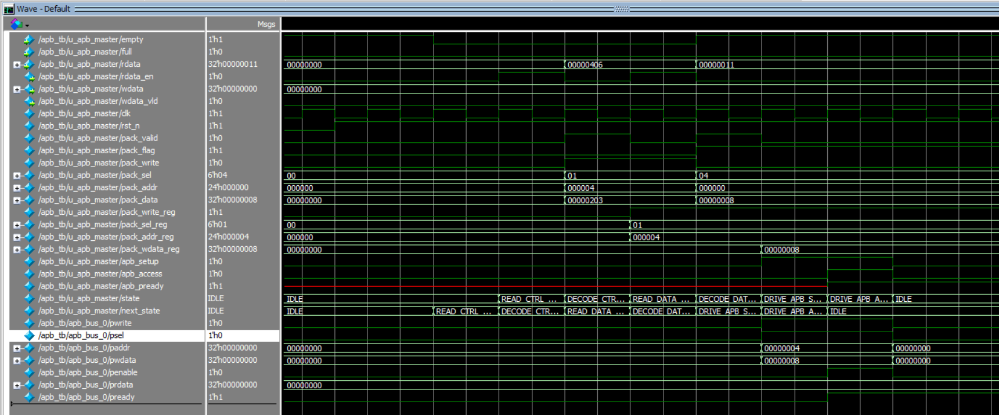

&ensp;&ensp;&ensp;&ensp;如上图所示，为 apb 写测试。我们对过程不再过多赘述。这里选择的测试向量为 控制包{24'h000004, 8'b00000110}，数据包 {31'h8, 1'b1}，即对 bus0 的地址 24'h000004 写入 数据 32'h8。通过观察 DRIVE_APB_ACCESS 状态周期的波形图我们容易验证其功能正确性。
### 3.2 ICB从机模块验证
&ensp;&ensp;&ensp;&ensp;对 icb slave 独立模块进行测试，由于不是对整个系统进行完整验证，我们用 testbench 输入向量激励模拟 fifo 与 icb 主机的行为。这里主要完成连续读写测试、rdata读测试、wdata写测试。
#### 3.2.1 连续读写
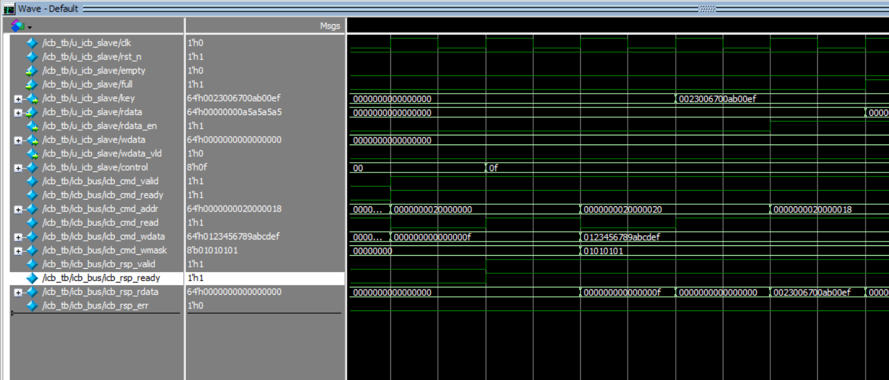

&ensp;&ensp;&ensp;&ensp;如上图所示，对寄存器 CONTROL (0x20000000) 与 KEY (0x20000020) 连续进行读写，第一周期对 CONTROL 写数据 8'h0f ，第二周期读 CONTROL ，第三周期对 KEY 写数据 64'h0123456789abcdef，同时这里设置掩码位 8'b01010101，即只写入奇数字节位，第四周期读 KEY。从读的结果中我们可以验证读写的正确性，可以看到读出的数据分别为 8'h0f 与 64'h0023006700ab00ef。
#### 3.2.2 wdata 写
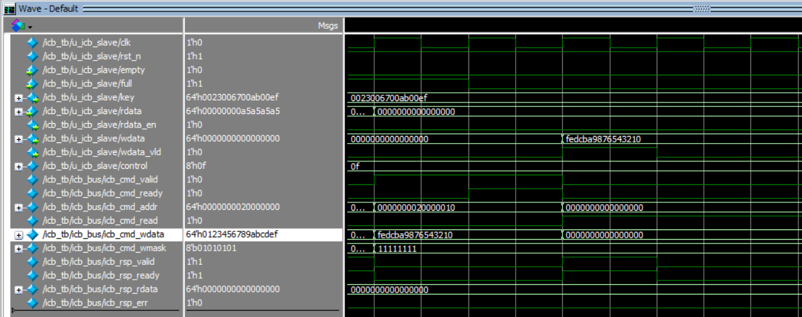

&ensp;&ensp;&ensp;&ensp;如上图所示，对寄存器 WDATA (0x20000010) 写数据 64'hfedcba987654321 ，同时设置掩码位 8'b11111111，即全有效。从波形图中可以看到，在第一周期 icb 主机发出写请求 cmd_valid 信号时，由于 full 有效，即 wfifo 满，无法响应主机的写入请求，因此 cmd_ready 保持低。下一周期，检测到 full 低，此时表示可以写入，从机响应写请求，完成控制通道握手。再下一周期，WDATA 接收主机写入数据，同时拉高 wdata_vld 信号向 wfifo 写入，同时完成 rsp 通道握手。

#### 3.2.3 rdata 读
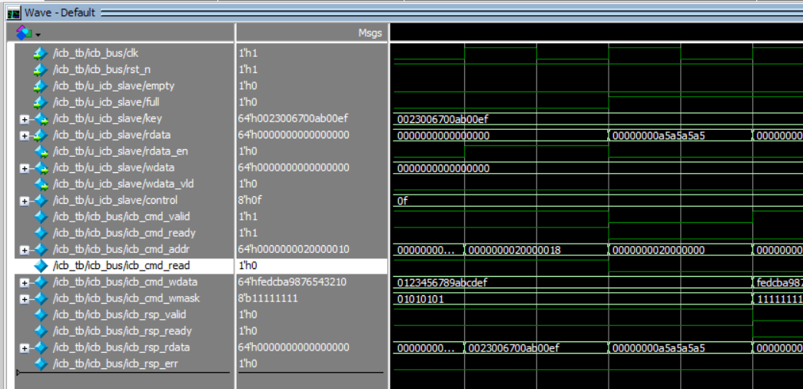

&ensp;&ensp;&ensp;&ensp;如上图所示，对寄存器 RDATA (0x20000018) 发送读数据请求。从波形图中可以看到，在第一周期 icb 主机发出读请求 cmd_valid 信号时，icb 从机响应请求，同时拉高 rfifo 的读使能信号 rdata_en 。下一周期，rfifo 返回数据 32'ha5a5a5a5，mux 选通后作为 icb_rsp_rdata 的返回数据，同时完成 rsp 通道握手。

### 3.3 FIFO模块验证
&ensp;&ensp;&ensp;&ensp;FIFO模块的验证较为简单，我们对其进行数据读写测试已经写满测试。

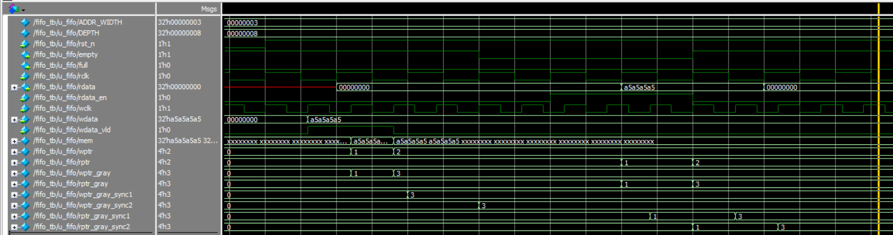

&ensp;&ensp;&ensp;&ensp;读写测试中，我们先向 FIFO 中在写时钟域写入两个周期的数据 32'hA5A5A5A5 ，当 empty 信号被拉低时，在读时钟域下读两次数据。从波形图中我们可以看到，读出的两周期数据正确。观察 empty 信号，由于将写指针同步到读时钟域采用了打两拍的操作，因此 empty 信号在写入第一个数据后没有立刻被拉低，但这并不影响其功能的正确性。将写指针同步到读时钟域下，而不是将读指针同步写时钟域下进行判空，也是为了保证 FIFO 在可以进行读操作的时候，FIFO 内一定存在可读数据。

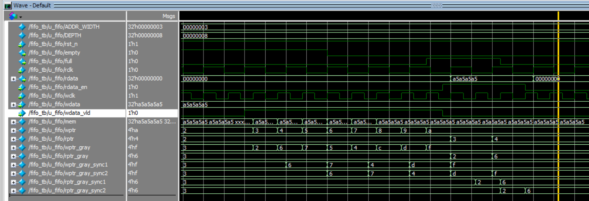

&ensp;&ensp;&ensp;&ensp;在写满测试中，我们向 FIFO 中连续写入 8 个周期的有效数据。从波形图中我们可以看到，当最后一个数据被写入 FIFO 后，full 信号被立即拉高，防止后续继续有数据被写入造成数据覆写。当完成一次读后，full 信号在打两拍同步后被拉低。

## 4. 实验总结
&ensp;&ensp;&ensp;&ensp;本次实验主要完成了 icb2apb 具备加解密功能的一主四从总线桥的设计与代码实现，并且对各模块进行了独立验证，通过一系列测试用例，确保各模块的功能性正确。在后续实验中，将包括对整个icb2apb总线桥的综合测试，以确保各个模块在集成后能够协同工作，达到预期的性能指标。同时，我们还将引入更多的测试向量，这些测试向量将覆盖更广泛的使用场景和边界条件，以进一步验证系统的鲁棒性和适应性。
## 5. quiz问答
### 5.1 diff_arrays.sv
运行结果如下图所示:

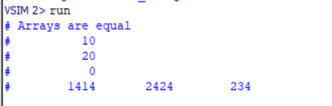

### 5.2 data_type.sv
#### 5.2.1 signed_vs_unsigned
将 b_signed_vs_unsigned 置为1，其余为0。直接编译运行，查看结果。

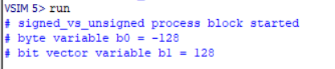

思考：如何可以使两者呈现一样的结果？

解决：显式指定 " byte unsigned b0 " ，重新运行结果如下：

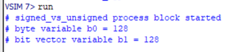
#### 5.2.2 bit_vs_logic
将 b_bit_vs_logic 置为1，其余为0。直接编译运行，查看结果。

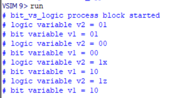

在SystemVerilog中，logic 类型是一个四值逻辑类型，可以表示0、1、X（未知）和Z（高阻抗）四种状态。而bit类型是一个二值逻辑类型，仅能表示0和1两种状态。当你将一个logic类型的值转换为bit类型时，四值逻辑中的X和Z状态会被转换为二值逻辑中的0状态，而0和1状态则保持不变。
#### 5.2.3 enum_type
将 b_enum_type 置为1，其余为0。直接编译运行，查看结果。

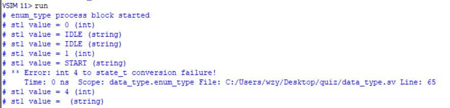

思考：如何修改使每次打印对应不同的状态并且不出现error？

解决：64 line 强制类型转换为 2 或 3：$cast(st3,2) 或 $cast(st3,3)，重新运行结果如下：

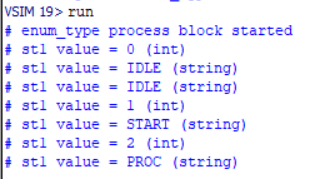

#### 5.2.4 struct_type
将 b_struct_type 置为1，其余为0。直接编译运行，查看结果。

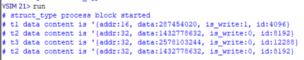

思考：将t1赋值语句中的 ’ 删去，重新编译，发现error。为什么会出现错误？SV对packed数据和Unpacked数据赋值时有怎样的不同。

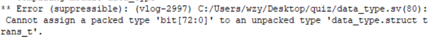

解决：Packed Arrays 支持直接的位操作，支持整体赋值，可以直接将一个值赋给整个数组，或者使用位分片语法对数组的某一部分进行赋值。而 Unpacked Arrays 是元素数组，每个元素可以是不同的类型，不支持直接的位操作，不支持位分片赋值，必须逐元素进行赋值，如果要整体赋值给unpacked数组，可以使用聚合赋值语法'{}。

#### 5.3 interface_type.sv
运行结果如下图所示:

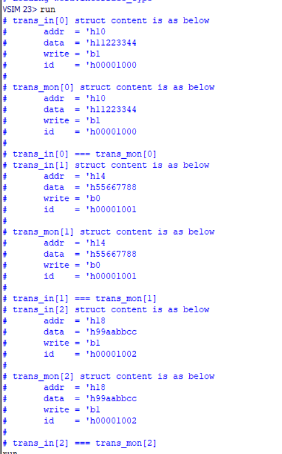

#### 5.4 task_and_function.sv

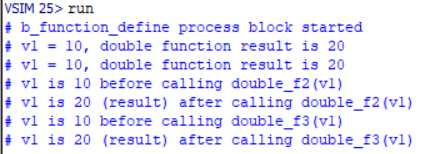

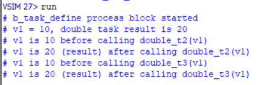

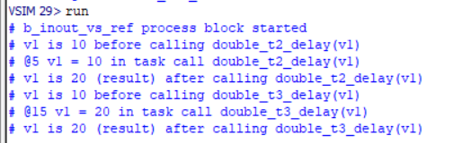

思考：function与Task的区别

解答：
+ function 不应包含任何时间控制语句，如延迟 (#) 、等待 (@) 或 wait 语句，这意味着 function 的执行不会消耗仿真时间。相反，task 可以包含这些时间控制语句，允许在执行过程中消耗时间。
+ task 可以调用其他 task 和 function ，而 function 只能调用其他 function。
+ function 必须至少有一个输入参数，并且可以有一个返回值，返回值通过 function 名称作为返回变量来传递。而 task 没有返回值，但可以通过 output 或 inout 参数来传递结果